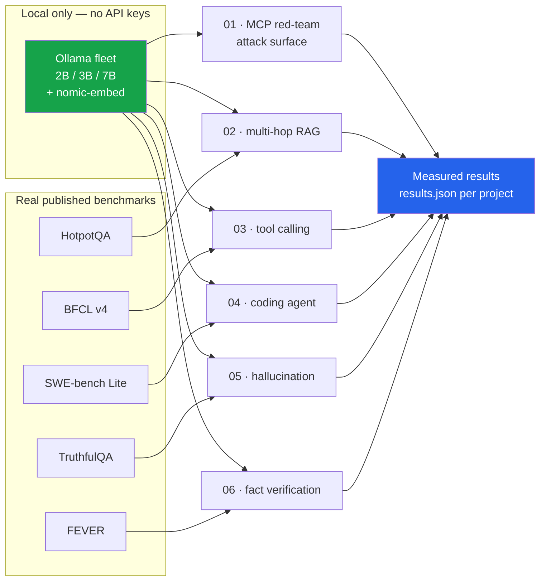

# mcp-lab — six agentic-AI projects on real benchmarks (MCP · LangChain · Ollama · FastAPI)

Six self-contained projects, each built on a **real published benchmark** with **real
measured numbers**, running entirely on **local models** — no API keys, no paid
inference, no synthetic data standing in for a dataset.

Every project is built around a finding, not a feature. Several of those findings are
negative, and they are reported as they came out.

---

## The six projects

| # | Project | Benchmark | Headline finding |
|---|---|---|---|
| **01** | [MCP Red-Team Platform](projects/01_mcp_redteam_platform) | self-built, 5 audit modules | A prompt-injection payload that scores **0%** in one delivery vector reaches **100%** in another — the same attack, moved |
| **02** | [Multi-Hop RAG Audit](projects/02_hotpotqa_multihop_rag) | HotpotQA | Retrieval finds the gold facts **83.6%** of the time, yet answer exact-match is **0.20**. The bottleneck is not retrieval |
| **03** | [Tool-Calling Accuracy](projects/03_bfcl_tool_calling) | BFCL v4 | **87.9% → 64.3%** across the local fleet, 700 real calls. Parallel multi-tool calls are where small models collapse |
| **04** | [SWE-bench Coding Agent](projects/04_swebench_coding_agent) | SWE-bench Lite | Both patches were rejected by `git apply` — **malformed diff syntax, not wrong logic.** The model could reason; it could not format |
| **05** | [Hallucination Rate](projects/05_truthfulqa_hallucination) | TruthfulQA | **Chain-of-thought made every single model worse.** The 7B dropped **60% → 25%**, a 35-point loss |
| **06** | [Fact-Verification Agent](projects/06_fever_fact_verification) | FEVER | **38.3%** on three-way verification with live Wikipedia retrieval |

Each project has its own README with the full method, the complete results, and an
honest account of what broke while building it.

---

## The finding worth reading first

**Project 05: chain-of-thought prompting made all five models worse on TruthfulQA.**

| Model | zero-shot | chain-of-thought | Δ |
|---|---:|---:|---:|
| qwen2.5:7b-instruct | **60%** | 25% | **−35 pts** |
| qwen2.5:3b-instruct | 45% | 23% | −22 pts |
| granite3.3:2b | 37% | 24% | −13 pts |
| llama3.2:3b | 36% | 22% | −14 pts |
| qwen2.5-coder:3b | 36% | 21% | −15 pts |

Not one model improved. CoT is near-universally recommended, and on this benchmark it is
actively harmful — the reasoning gives the model room to talk itself into the plausible
misconception that TruthfulQA is built to elicit.

---

## How the projects fit together



---

## What is shared, and what is not

Each project has **its own virtual environment**. That is deliberate, not disorganised:
project 01 pins `mcp<2` because `mcp>=2` renamed `FastMCP` to `MCPServer`, and forcing
one environment across all six would mean pinning every project to the oldest
constraint any of them has.

Project 06 deliberately does **not** use LangChain — it calls Ollama's `/api/embeddings`
and `/api/chat` over HTTP directly, because going through a framework wrapper for two
endpoints was more code, not less. Each README says which libraries it actually imports.

---

## Status

✅ All six built, tested and committed. Every number in every README came from running
the code.

🔴 **Pending: 3B vs 14B comparison.** These results use a fleet topping out at 7B.
`qwen2.5-coder:14b` is downloading; when it lands, each project gains a comparison row
rather than being rewritten. Project **04** matters most — its patches failed on *diff
formatting*, and whether a larger model fixes that is a real open question.

---

## Running a project

```bash
cd projects/03_bfcl_tool_calling
uv venv && uv pip install -e .
python run.py          # writes results.json
pytest -q
```

Each project directory is self-contained: its own `pyproject.toml`, its own venv, its own
tests, its own `results.json`.

## Requirements

- [Ollama](https://ollama.com) running locally with at least one chat model pulled
- Python 3.11+
- Project 04 additionally needs **Docker** (it runs real repos in a real sandbox)

## Stack

`Model Context Protocol (MCP)` · `LangChain` + `langchain-ollama` · `Ollama` ·
`FastAPI` + `Jinja2` · `httpx` · `Hugging Face datasets` · `Pydantic` · `Docker` ·
`pytest` · `uv`

## Keywords

agentic AI · LLM agents · Model Context Protocol · MCP server · tool calling ·
function calling · BFCL · HotpotQA · multi-hop RAG · SWE-bench · TruthfulQA · FEVER ·
hallucination detection · prompt injection · red teaming · LLM security ·
retrieval-augmented generation · citation faithfulness · local LLM · Ollama · Qwen2.5 ·
chain-of-thought · LLM evaluation · benchmark reproducibility · fact verification
