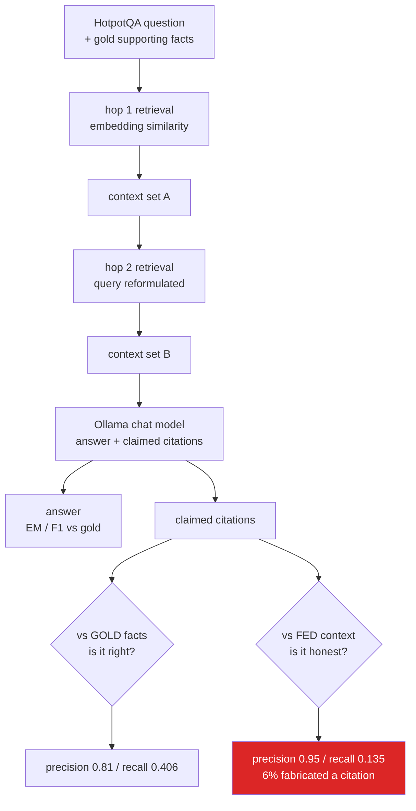

# 02 · Multi-Hop RAG Audit (Datasets, LangChain-Ollama, httpx, Pydantic)

Audits a local, 2-hop retrieval-augmented-generation pipeline over the real
**HotpotQA** dataset: does the model's *claimed* citations match HotpotQA's
gold supporting facts, and do they match what the retrieval pipeline
*actually fed it*? Both are measured separately and both numbers below are
from one real run — no numbers here are estimated.

Libraries this code actually imports: `datasets` (HF Hub dataset loading),
`httpx` (Ollama `/api/tags` and `/api/embed` calls), `langchain_ollama`
(`ChatOllama` + `.with_structured_output`), `pydantic` (the structured
answer/citation schema), `pytest` (tests). No API keys, no external LLM
calls — everything runs against a local Ollama server.

## Dataset

- Source: `hotpotqa/hotpot_qa` on the Hugging Face Hub (the maintained,
  parquet-backed mirror — see "Problems hit" below for why this isn't just
  `hotpot_qa`), config `distractor`, split `validation` (7,405 examples
  total).
- Sample actually evaluated: **50 examples**, `random.shuffle(seed=42)` via
  `datasets.Dataset.shuffle(seed=42).select(range(50))`, i.e. a fixed,
  reproducible subset — not the full validation split.
- Each example provides: a question, a short gold answer, ~10 context
  paragraphs (mix of gold-relevant and distractor paragraphs, each split
  into sentences), and gold `supporting_facts` as `(title, sentence_index)`
  pairs.

## Method

1. **Flatten** every context paragraph into individual `(title, sentence_index,
   text)` sentences.
2. **Hop 1**: embed the raw question with `nomic-embed-text` (via Ollama's
   `/api/embed`, batched), embed every candidate sentence the same way, and
   take the top-4 sentences by cosine similarity.
3. **Hop 2**: build a second query = question + the text of the hop-1
   sentences (so whatever bridge entity/fact hop 1 surfaced is carried
   forward), embed it, and take the top-4 *additional* sentences (hop-1
   picks excluded) by cosine similarity.
4. The **union of hop-1 + hop-2 sentences (≤8 sentences) is exactly what
   gets fed** into the answer-generation prompt — this set is logged as
   `fed_facts`, independent of anything the model later claims.
5. **Answer generation**: `qwen2.5:7b-instruct` (the strongest model
   confirmed pulled — see below) via
   `ChatOllama(...).with_structured_output(CitedAnswer)`, where `CitedAnswer`
   is a Pydantic model with a required `answer: str` and a required
   `supporting_facts: list[{title, sentence_index}]` (`min_length=1`). The
   prompt shows the model only the fed sentences, each numbered and labeled
   with its exact `(title, sentence_index)`, and instructs it to answer
   using only those and to cite the ones it used.
6. **Scoring**, per example: answer exact-match/F1 (SQuAD-style
   normalization), and three-way comparison over `(title, sentence_index)`
   sets — gold vs. fed (retrieval recall), claimed vs. gold (citation
   correctness), and claimed vs. fed (citation faithfulness) — plus an
   explicit "fabricated citation" list: anything the model cited that was
   never in the fed set at all.

Models confirmed pulled and reachable at `http://127.0.0.1:11434` before the
run: `qwen2.5:7b-instruct`, `llama3.2:3b`, `qwen2.5-coder:3b`,
`granite3.3:2b`, `nomic-embed-text:latest`, `qwen2.5:3b-instruct` (the brief
said this last one "may or may not be present" — it was). Chat model used:
`qwen2.5:7b-instruct`. Embedding model: `nomic-embed-text`.

## Real measured result (n=50, seed=42, full run in `results.json`)

| Metric | Value |
|---|---|
| Answer exact-match | 0.20 |
| Answer F1 | 0.436 |
| Retrieval recall of gold facts (were gold facts even retrieved?) | 0.836 |
| Claimed vs. **gold** — precision | 0.81 |
| Claimed vs. **gold** — recall | 0.406 |
| Claimed vs. **gold** — F1 | 0.523 |
| Claimed vs. **fed** — precision (faithfulness: is what it cites really shown to it?) | 0.95 |
| Claimed vs. **fed** — recall (how much of what it used does it admit to?) | 0.135 |
| % examples with ≥1 fabricated citation (cited something never fed) | 6% |
| Avg. fabricated citations / example | 0.06 |

### The core finding

The two citation numbers tell different stories, and that gap is the
interesting result:

- **Claimed-vs-fed precision is high (0.95)** — when the model cites a
  sentence, it's almost always a sentence that really was in the prompt.
  It's not inventing sentences out of thin air in the vast majority of
  cases (only 3/50 examples had any fabricated citation).
- **Claimed-vs-fed recall is very low (0.135)** — the model is fed up to 8
  sentences per question but, even when explicitly instructed to list
  every sentence it relied on, it typically cites only 1 (the schema's
  `min_length=1` floor). So the citation the model gives is *plausible and
  real*, but it is a drastic undercount of what the pipeline actually put
  in front of it. A reader trusting the citation as "the complete list of
  what was used" would be misled about how much context actually went into
  the answer.
- **Claimed-vs-gold recall (0.406) trails claimed-vs-gold precision (0.81)**
  for the same reason: because the model only names ~1 fact, it can be
  *correct* about that one fact (driving precision up) while still missing
  most of the gold multi-hop chain (driving recall down). Retrieval itself
  is doing reasonably well (0.836 recall of gold facts actually reached the
  prompt) — the loss is concentrated in the model under-reporting its own
  citation list, not in retrieval failing to find the right sentences.

In short: **citations that are shown are trustworthy (rarely fabricated),
but they are systematically incomplete** — a plausible-looking citation
list that quietly hides most of what the model was actually given.

## Problems hit while building this (honest account)

- **`load_dataset("hotpot_qa", "distractor", ...)` fails outright** on the
  `datasets` version pinned in this project (Hugging Face deprecated
  loading-script-based dataset repos and the old `hotpot_qa` repo's
  `.huggingface.yaml`/script path raises `HfUriError: Repository id must be
  'namespace/name'`). The fix was switching to the maintained parquet
  mirror, `hotpotqa/hotpot_qa` (same config/split names, same schema).
- **The download was much larger and slower than expected.** Even though
  only the `validation` split was requested, `datasets` pulled both
  `distractor` **train** parquet shards (~90k examples) in addition to
  validation before the validation arrow cache was built — around 245MB
  total instead of the ~20-30MB a validation-only fetch would suggest.
  Combined with five other agents hitting the network/disk on the same
  machine at the same time, an initial download attempt stalled for
  several minutes at a time and was killed by an unrelated host restart
  mid-download; it had to be resumed (Hugging Face's partial-file resume
  handled this automatically once re-invoked) rather than restarted from
  scratch. Once the parquet-to-arrow cache was actually built, subsequent
  loads are instant.
- **The most important surprise was in citation generation, not
  retrieval.** The initial schema made `supporting_facts` an *optional*
  field (`Field(default_factory=list)`). Against a short, hand-written test
  prompt the model reliably populated it — but against real retrieved
  context (up to 8 sentences, real HotpotQA phrasing with embedded quote
  marks, repeated titles across a paragraph) the model would frequently
  return a syntactically valid structured response with `supporting_facts`
  omitted entirely (raw model JSON was literally `{"answer": "..."}`),
  even though it answered correctly. Making the field required in the
  Pydantic schema alone didn't fix it (JSON schema `required` only means
  the key must be present, not non-empty). Adding `min_length=1` to the
  list field — so the JSON schema constrains the model to emit at least one
  array element — is what actually forced consistent citation output. This
  is reported in the results as-is: the model still tends to cite only the
  schema-minimum of one fact per answer rather than being exhaustive, which
  is the low claimed-vs-fed recall documented above. That under-citing
  behavior is a real, measured property of the model under this prompt —
  not a bug we patched away.
- **Answer exact-match (0.20) is low** relative to answer F1 (0.436),
  consistent with the model giving a correct but differently-phrased or
  more verbose answer (e.g. "English" vs. gold "Prussian" for a
  narrator-inference question, or restating the question back with the
  answer embedded) rather than the terse gold-style answer HotpotQA
  expects. This wasn't specifically tuned/prompted for since the audit's
  focus is the citation behavior, not maximizing answer accuracy.

## Files

- `pipeline.py` — dataset loading, embedding/retrieval, structured
  generation, and scoring logic (all the real logic; unit-testable without
  a live server where possible).
- `run_experiment.py` — CLI that runs the pipeline over a seeded sample and
  writes `results.json`. Run from repo root:
  `uv run python projects/02_hotpotqa_multihop_rag/run_experiment.py --n 50 --seed 42`
- `results.json` — the actual output of the n=50, seed=42 run reported
  above, including every example's question, gold/model answers, gold
  facts, fed facts, claimed facts, and fabricated citations.
- `tests/test_02_hotpotqa.py` (repo `tests/` dir, per shared project
  convention) — pure-logic tests (scoring, normalization, cosine
  similarity) run unconditionally; tests that need a live Ollama server or
  a live HF Hub dataset fetch are marked `@pytest.mark.live` (16 tests
  total, all passing: `uv run pytest tests/test_02_hotpotqa.py -v`; use
  `-m "not live"` to skip the 5 live ones).

## Not done / left for follow-up

- The FastAPI + Jinja2 example-viewer page (deliverable 5, explicitly
  lower priority) was not built — deliverables 1-4 (working pipeline, real
  measured results, passing tests, this README) were the priority and took
  the full time budget, largely because of the dataset-download and
  citation-schema issues described above.
- The sample is 50 of 7,405 validation examples; metrics are informative
  at this scale but would tighten with a larger run (e.g. n=200+) if more
  time/compute were available.

---

## How it works

Scoring citations **twice** - once against the gold facts and once against what was
actually fed to the model - separates "cited the wrong thing" from "cited something it
was never shown", which a single number cannot do.

## Keywords

HotpotQA · multi-hop reasoning · retrieval-augmented generation · RAG evaluation ·
citation faithfulness · attribution · hallucinated citations · grounding ·
embedding retrieval · LangChain · Ollama · local LLM · question answering ·
LLM evaluation · faithfulness metrics
