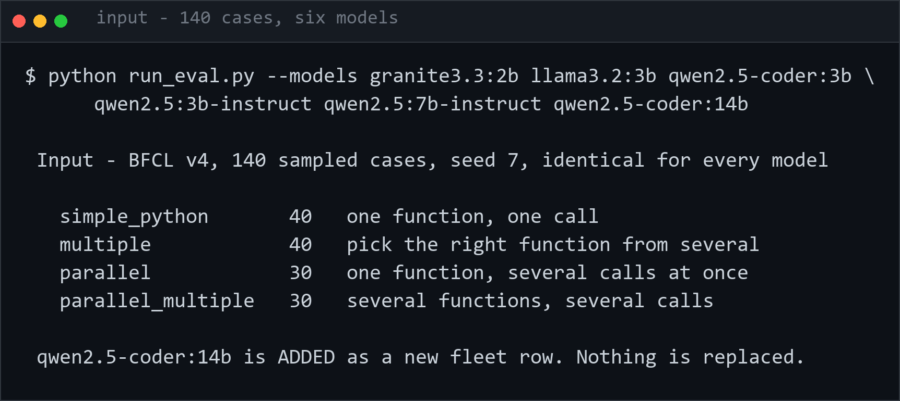
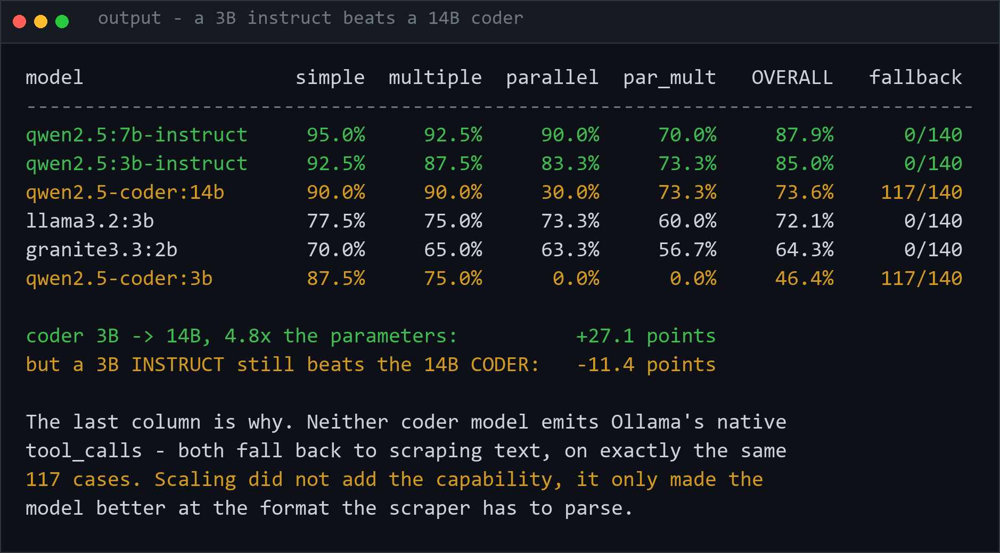
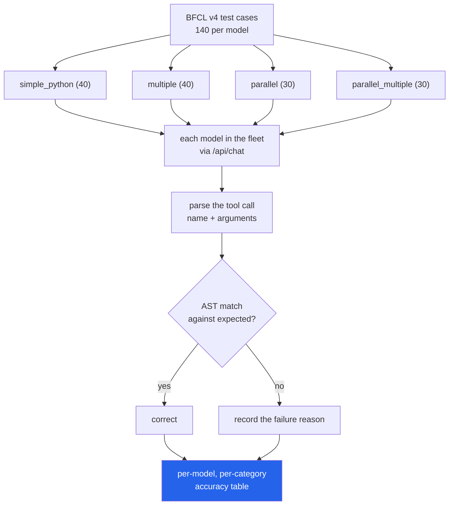

# 03 · Tool-Calling Accuracy Across the Local Fleet (Ollama, LangChain-Ollama, httpx)

Real, measured tool-calling (function-calling) accuracy for every chat-capable
model in the local Ollama fleet, scored against real Berkeley Function-Calling
Leaderboard (BFCL) v4 test cases.

Libraries this code actually imports: `langchain_ollama` (`ChatOllama.bind_tools`),
`langchain_core.messages`, `httpx`, `fastapi` + `fastapi.templating.Jinja2Templates`
(for the optional results viewer), and stdlib (`json`, `re`, `itertools`, `argparse`,
`random`, `pathlib`). Tests use `pytest`.

## Dataset / source

Real BFCL v4 test-case JSON, fetched directly over HTTPS (no API key -- this is
static data, not an LLM call) from the public, Apache-2.0-licensed GitHub repo:

```
https://raw.githubusercontent.com/ShishirPatil/gorilla/main/berkeley-function-call-leaderboard/bfcl_eval/data/BFCL_v4_<category>.json
https://raw.githubusercontent.com/ShishirPatil/gorilla/main/berkeley-function-call-leaderboard/bfcl_eval/data/possible_answer/BFCL_v4_<category>.json
```

Fetched and cached by `bfcl_data.py` into `data/` on first use (already present
in this repo checkout from the actual run below).

### Categories used, and why

BFCL v4 ships many categories, several of which need a live executable API
backend (the "executable" categories) or multi-turn conversation state (the
"multi_turn_*" categories) -- neither is feasible with local Ollama models and
no real backend, so both are skipped, per the brief. We used the four
non-executable, single-turn, AST-scored categories that are directly runnable:

| Category | What it tests | Cases available | Cases sampled |
|---|---|---:|---:|
| `simple_python` | one function offered, one call expected | 400 | 40 |
| `multiple` | several functions offered, one call expected (pick the right one) | 199 | 40 |
| `parallel` | one function offered, several calls expected | 199 | 30 |
| `parallel_multiple` | several functions offered, several calls expected | 199 | 30 |

**140 test cases total**, sampled with a fixed seed (`SEED = 7` in
`run_eval.py`, via `random.Random(7).sample(...)`) so the run is reproducible.

## Method

1. `schema_convert.py` converts BFCL's own parameter-schema dialect (`"type":
   "dict"/"tuple"/"any"/...`) into standard JSON Schema / OpenAI-tool format
   (`dict`&rarr;`object`, `float`&rarr;`number`, `tuple`&rarr;`array`, `any`&rarr;no
   type constraint, recursively for nested `properties`/`items`).
2. `harness.py` builds the tool list for each case and calls
   `ChatOllama(model=..., temperature=0).bind_tools(tools).invoke(messages)` --
   Ollama's native `tools` chat parameter, per the brief. `AIMessage.tool_calls`
   is read back as the model's prediction.
3. `scoring.py` implements an AST-equivalent checker from scratch (not BFCL's
   own checker code): function name must match exactly, every ground-truth
   parameter must be present with a value equal to one of its accepted values
   (BFCL's `""` sentinel marks a parameter as optional/omittable), and no
   extra/hallucinated parameters are allowed. For `parallel`/`parallel_multiple`
   cases, predicted calls are matched against ground truth allowing any
   permutation (order doesn't matter) with an exact count requirement. Numeric
   values are compared with lenient string/number coercion (some models return
   `"10"` for `10`); strings are compared case-insensitively.
4. `run_eval.py` auto-detects chat-capable models from `GET /api/tags`
   (anything with `"completion"` in `capabilities`, which excludes
   `nomic-embed-text`), runs all 140 sampled cases against each, and writes
   `results.json`.

## Models evaluated (real fleet, verified via `/api/tags` before running)

`qwen2.5:7b-instruct` (7.6B), `qwen2.5:3b-instruct` (3.1B), `qwen2.5-coder:3b`
(3.1B), `llama3.2:3b` (3.2B), `granite3.3:2b` (2.5B). `nomic-embed-text` was
present but correctly excluded (embedding-only, no `"completion"` capability).
All five report `"tools"` in their advertised Ollama capabilities.

## Real measured results

Full run **(2026-09-16, 6 models)**: 6 models x 140 cases = 840 real Ollama
calls, wall time 1380.0s (~23 min), 0 request errors/timeouts.
`qwen2.5-coder:14b` alone took 697.1s -- half the total. Raw per-case data
(including every prediction and every failure reason) is in `results.json`;
the previous 5-model run is kept at `results_baseline_5models.json`.

| Model | simple_python (40) | multiple (40) | parallel (30) | parallel_multiple (30) | **Overall (140)** |
|---|---:|---:|---:|---:|---:|
| **qwen2.5:7b-instruct** | 95.0% (38/40) | 92.5% (37/40) | 90.0% (27/30) | 70.0% (21/30) | **87.9% (123/140)** |
| **qwen2.5:3b-instruct** | 92.5% (37/40) | 87.5% (35/40) | 83.3% (25/30) | 73.3% (22/30) | **85.0% (119/140)** |
| **llama3.2:3b** | 77.5% (31/40) | 75.0% (30/40) | 73.3% (22/30) | 60.0% (18/30) | **72.1% (101/140)** |
| **granite3.3:2b** | 70.0% (28/40) | 65.0% (26/40) | 63.3% (19/30) | 56.7% (17/30) | **64.3% (90/140)** |
| **qwen2.5-coder:14b** | 90.0% (36/40) | 90.0% (36/40) | 30.0% (9/30) | 73.3% (22/30) | **73.6% (103/140)** |
| **qwen2.5-coder:3b** | 87.5% (35/40) | 75.0% (30/40) | 0.0% (0/30) | 0.0% (0/30) | **46.4% (65/140)** |

### 2026-09-16 · the 14B coder: scaling helps, and the tune still decides

`qwen2.5-coder:14b` was added as a **new fleet row**, not a replacement.

| | |
|---|---:|
| coder **3B &rarr; 14B** (4.8x parameters) | **+27.1 points** (46.4% &rarr; 73.6%) |
| 14B **coder** vs 3B **instruct** | **-11.4 points** (73.6% vs 85.0%) |
| 14B **coder** vs 7B **instruct** | **-14.3 points** (73.6% vs 87.9%) |

Scaling the coder tune helps a great deal — and **a 3B instruct model still
beats a 14B coder model at tool calling by 11.4 points, at a fifth of the
size.** On this task the tune matters more than the parameter count.

**Why, precisely.** This project records whether each case used Ollama's
native `tool_calls` field or the best-effort fallback text parser:

| Model | cases needing the fallback parser |
|---|---:|
| `qwen2.5:7b-instruct` | 0 / 140 |
| `qwen2.5:3b-instruct` | 0 / 140 |
| `llama3.2:3b` | 0 / 140 |
| `granite3.3:2b` | 0 / 140 |
| `qwen2.5-coder:3b` | **117 / 140** |
| `qwen2.5-coder:14b` | **117 / 140** |

**The 14B coder does not support native tool-calling either — the same 117
cases, exactly.** Scaling the model 4.8x did not add the capability; it only
made the model better at the text format the fallback parser has to scrape.
That is why `parallel` remains its worst category at 30.0%, where the failures
read `call count mismatch: predicted 0 vs expected 2` — nothing to scrape.

The gain is real and concentrated: `parallel_multiple` went 0.0% &rarr; 73.3%,
tying the best model in the fleet. But a capability the tune does not have is
not something size buys back.

### The original 5-model finding

**`qwen2.5:7b-instruct` is the most accurate tool-caller in the fleet at
87.9% overall, beating the next-best model (`qwen2.5:3b-instruct`, 85.0%) by
2.9 points**, and it's the best or tied-best in every individual category.
Interestingly the accuracy gap between the 7B and 3B Qwen2.5-instruct models is
small -- the 3B model is a genuinely strong tool-caller for its size, only
clearly losing ground on `parallel` (single function, multiple calls: 83.3%
vs 90.0%).

The bigger story is **`qwen2.5-coder:3b`**, which is competitive on
single-call categories (87.5% on `simple_python`, actually *higher* than the
3B instruct model) but **scores exactly 0% on both parallel categories** --
see "Problems hit" below for why. All four other models degrade gracefully
from single-call to multi-call categories; `qwen2.5-coder:3b` falls off a
cliff instead. `granite3.3:2b`, the smallest model (2.5B), is the weakest
non-coder model across the board, consistent with its size.

Every category also gets harder for every model in roughly the same order:
`simple_python` > `multiple` > `parallel` > `parallel_multiple` -- i.e. having
to choose the right function among several *and* emit several calls
(`parallel_multiple`) is the hardest combination for all five models, capping
out at 73.3% even for the best model outside qwen2.5:7b-instruct.

## Input



## Output



## Problems hit while building this

- **`qwen2.5-coder:3b` does not reliably use Ollama's native tool-calling
  protocol.** Despite `ollama` reporting `"tools"` in its capabilities, this
  model's `/api/chat` response came back with an **empty `tool_calls` field**
  on essentially every request in our sample; instead it prints a
  JSON-looking function call as plain assistant *text content* (sometimes
  fenced in ```` ```json ```` blocks). We added a best-effort fallback parser
  (`harness._try_parse_content_as_calls`) that extracts a `{"name":...,
  "arguments":...}`-shaped object from the text so this model isn't scored as
  "produced nothing" -- every case record in `results.json` has a
  `used_fallback_parse` flag so this is fully transparent. Concretely:
  `qwen2.5-coder:3b` used the native `tool_calls` field on **0 of 140**
  cases; the fallback text-parser recovered a call on 40/40 (`simple_python`),
  40/40 (`multiple`), 18/30 (`parallel`), 19/30 (`parallel_multiple`), and
  produced nothing parseable at all on the remaining 23 cases.
- **That fallback text format never contains more than one call object**,
  even when the prompt clearly asks for several (e.g. "play these two songs").
  Every single `parallel`/`parallel_multiple` failure for this model was a
  `call count mismatch: predicted 1 vs expected N` (or `predicted 0`) --
  never a wrong-function or wrong-argument failure. This is a structural
  limitation of the model's output format for this repo's tool-calling setup,
  not a scoring-harness bug, and it's the reason `qwen2.5-coder:3b` scores
  exactly 0% on both parallel categories while still doing reasonably well on
  single-call categories.
- **Cold-start latency is real and lumpy.** The first call to a
  just-swapped-in model took 10-13s (Ollama loading weights into memory)
  versus <1-3s once warm. `run_eval.py` evaluates one model against *all*
  sampled cases before moving to the next (rather than interleaving models
  per case) specifically to pay that cold-start cost once per model, and sets
  `keep_alive="10m"` so the model doesn't unload mid-run. A per-request
  timeout of 90s was used; the actual run had 0 timeouts/errors.
  `qwen2.5:7b-instruct` was ~3-8x slower per call than the 3B/2B models
  (largest weights, CPU inference), and it shows: its 140-case run alone took
  691s of the 1544s total wall time.
- **BFCL's own AST checker was not reused** -- it lives deep in
  `bfcl_eval.eval_checker` inside the gorilla repo with its own dependency
  tree and multi-turn/executable-category machinery we didn't need. We
  reimplemented the checking logic described in the brief (name match,
  required-arg match against BFCL's accepted-value lists including the `""`
  optional-parameter sentinel, no hallucinated args, permutation-based
  matching for parallel calls) from scratch in `scoring.py`, with lenient
  numeric string/number coercion added after observing `llama3.2:3b` return
  numeric arguments as strings (e.g. `"10"` instead of `10`). This is a
  reasonable equivalent, not a byte-for-byte reproduction of BFCL's official
  scorer.
- Sample size (140 cases/model, 40/40/30/30 split) was chosen to keep the full
  5-model run to well under 30 minutes wall time on CPU-only local Ollama,
  rather than running the full leaderboard set (400+199+199+199 = 997 cases
  per model, which would have taken hours for the slower models). This is a
  deliberately reduced, clearly documented scope, not the full BFCL leaderboard.

## What's finished vs. left for follow-up

**Finished and solid:**
1. Real end-to-end harness (`bfcl_data.py`, `schema_convert.py`, `harness.py`,
   `scoring.py`, `run_eval.py`) calling real BFCL cases against real local
   Ollama models via `langchain_ollama.ChatOllama.bind_tools`.
2. Real measured results in `results.json` (per-model, per-category accuracy,
   every prediction, every failure reason, latencies) -- nothing in this
   README or results.json is estimated.
3. 16 pytest tests in `tests/test_03_bfcl.py`: 14 pure-logic tests (schema
   conversion, AST-equivalent scoring, including the parallel-call
   permutation matcher and the optional-parameter sentinel) that always run,
   plus 2 tests marked `@pytest.mark.live` that hit the real network/Ollama
   server end-to-end.
4. This README with real numbers and an honest problems section.

**Left for follow-up (not attempted, out of scope for this pass):**
- BFCL's `live_*` categories (real user-contributed prompts, same AST scoring
  style) were not run -- only the original `simple`/`multiple`/`parallel`/
  `parallel_multiple` categories, to keep scope bounded.
- No investigation into *why* `qwen2.5-coder:3b`'s Ollama tool-calling
  template doesn't populate `tool_calls` (likely a chat-template issue in how
  that model tag was built/quantized) -- documented as an observed fact, not
  root-caused.
- No retry/temperature-sampling variance analysis (everything run at
  `temperature=0`, single sample per case, matching the brief's ask for a
  clearly documented single real run rather than statistical estimation).


---

## How it works



Every model sees identical cases, so the table compares models rather than prompts.
700 real calls, zero request errors.

## Keywords

BFCL · Berkeley Function Calling Leaderboard · tool calling · function calling ·
agent evaluation · LLM benchmarking · structured output · JSON mode · parallel tool use ·
Ollama · Qwen2.5 · Llama 3.2 · Granite · local LLM · model comparison
