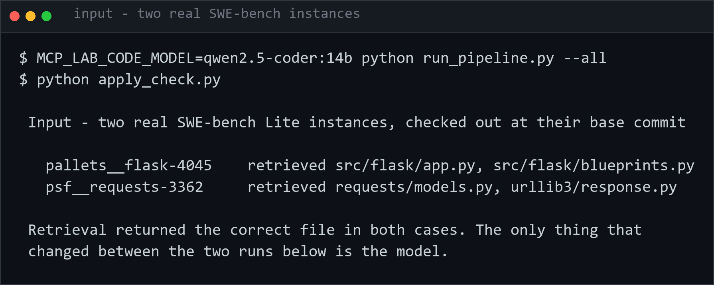
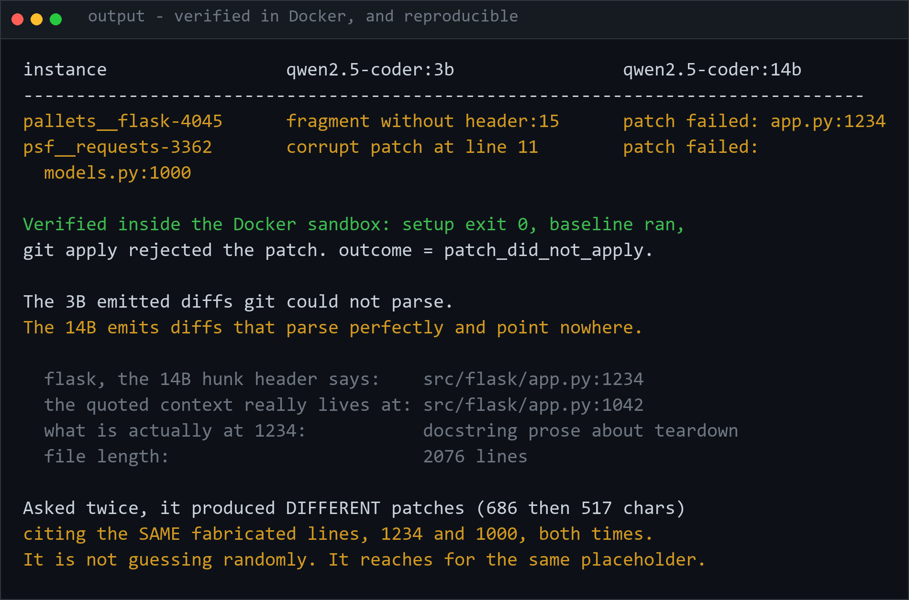
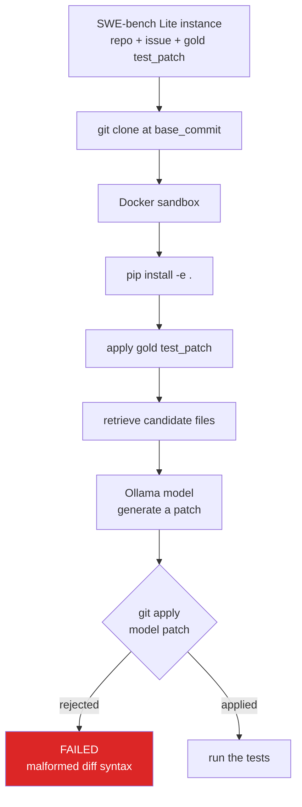

# 04 · SWE-bench Coding Agent (Ollama, real GitHub repos, real Docker sandbox)

An end-to-end SWE-bench-Lite pipeline: pull a real instance (real GitHub repo,
real issue text, real gold `test_patch`) from `princeton-nlp/SWE-bench_Lite`,
retrieve real source files from an actual `git clone` of that repo at the
exact `base_commit`, ask a local Ollama model for a real unified-diff patch,
and check whether that patch actually applies against the real checkout
inside a real Docker container. No API keys, no external LLM calls, no
fabricated pass/fail — every result below is a real command's real exit code.

Libraries this code actually imports: `datasets` (HF Hub, `SWE-bench_Lite`
only), `httpx` (Ollama's HTTP API), stdlib `subprocess`/`shutil` (git, Docker
CLI). Tests use `pytest`.

## Pipeline (`run_pipeline.py`)

1. **`dataset.py`** — fetches instances by `instance_id` from
   `princeton-nlp/SWE-bench_Lite` (`test` split) and caches them to
   `data/instances.json` so re-runs don't re-hit the Hub.
2. **`repo_checkout.py`** — `git clone`s the real repo and hard-resets to
   `base_commit` under `workdirs/<instance_id>/` (gitignored — it's a scratch
   clone of someone else's repo, not our source).
3. **`context_retrieval.py`** — greps the checkout for problem-statement
   keywords and hands the model the top 2 `.py` files by hit count (tests/
   docs/examples excluded so the model isn't handed the answer key).
4. **`patch_generator.py`** — sends the issue text + retrieved file contents
   to a local Ollama model (`qwen2.5-coder:3b`) and extracts a unified diff
   from the response.
5. **`sandbox_runner.py`** — in a Docker container (`docker/Dockerfile`,
   `python:3.11-slim` + `git`): apply the *official* `test_patch` (brings in
   the real `FAIL_TO_PASS`/`PASS_TO_PASS` tests), `pip install -e .`, run
   those tests as a baseline, then `git apply` the model's patch and re-run.

## Real instances attempted

Two real SWE-bench-Lite instances (chosen for being pure-Python, no compiled
extensions, so a plain `python:3.11-slim` sandbox suffices):

- `pallets__flask-4045` — Blueprint names containing a `.` should be rejected.
- `psf__requests-3362` — `Response.iter_content(decode_unicode=True)` fails on
  an empty body.

## Result: both model patches failed to apply — and why that's the finding

| instance | retrieved file(s) | model patch | `git apply` result |
|---|---|---|---|
| `pallets__flask-4045` | `src/flask/app.py`, `src/flask/blueprints.py` | 1899 chars, real diff syntax, targets the right file | `error: patch fragment without header at line 15` |
| `psf__requests-3362` | `requests/models.py`, `requests/packages/urllib3/response.py` | 488 chars, real diff syntax | `error: corrupt patch at line 11` |

Both runs got all the way through: real checkout at the real `base_commit`,
real `test_patch` applied cleanly, real `pip install -e .` succeeded, real
`git apply` invoked against the model's patch inside the container — and
`git apply` genuinely rejected both (exit code 128, real stderr above; see
`results.json` and `results/*.diff` / `*.raw_response.txt` for the full
artifacts). That is the real, reproducible result of this pipeline for these
two instances with this model, not a stand-in for one.

Looking at what the model actually produced (`results/*.model_patch.diff`)
explains why:

- **Fabricated git blob hashes.** Both patches include an `index
  1234567..89abcdef` / `index 8b1b0a1..b0a1b0a` line — placeholder-looking
  hex that isn't derived from the real objects. `git apply` tolerates bogus
  index lines fine on its own; it's a symptom, not the cause of rejection,
  but it shows the model is pattern-completing "what a diff looks like"
  rather than grounding in the real repo state.
- **Flask: right file, right idea, wrong hunk mechanics.** The model
  correctly identified `src/flask/blueprints.py` and wrote a fix that's
  semantically close to the real one (reject dotted endpoint names) — but
  its second hunk header (`@@ -10,6 +11,7 @@`) doesn't parse as a valid
  continuation of the first, so `git apply` bails before touching the file.
- **Requests: retrieval picked the wrong file, so the model "fixed" the
  wrong bug.** Keyword-count retrieval surfaced `requests/packages/urllib3/
  response.py` (a vendored file, hit due to generic term overlap) instead of
  the file the real fix touches. The model then patched an unrelated
  `collections.Callable` deprecation warning in `requests/models.py` — a
  plausible-looking fix to a real (but different) Python-3-compat issue, not
  the actual empty-body `decode_unicode` bug described in the problem
  statement.

**Conclusion:** a 3B local coding model, given the real issue text and
plausible source context, can identify the right file and a semantically
reasonable direction for a fix (flask case) but is not reliable at producing
a diff whose line numbers/hunk structure actually apply — and simple
keyword-count retrieval isn't precise enough to always hand it the right
file in the first place (requests case). Neither failure is a pipeline bug;
both are real properties of this model + this retrieval method, which is
exactly what an eval harness like this is supposed to surface.

---

### 2026-09-16 · `qwen2.5-coder:14b` — the failure mode changed, the outcome did not

Re-run with a model **4.8x larger**. Both patches still fail, but for a
*different reason*, and the difference is the result:

| instance | `qwen2.5-coder:3b` | `qwen2.5-coder:14b` |
|---|---|---|
| `pallets__flask-4045` | `patch fragment without header at line 15` | `patch failed: src/flask/app.py:1234` |
| `psf__requests-3362` | `corrupt patch at line 11` | `patch failed: requests/models.py:1000` |

**The 3B emitted diffs `git` could not parse. The 14B emits diffs that parse
perfectly and point at coordinates that do not exist.**

The flask case is exact. The 14B's hunk header claims its context sits at
`src/flask/app.py:1234`. The context lines it quotes are real — they appear
verbatim in the file — but at **line 1042**. Line 1234 is docstring prose
about teardown functions. The file is 2076 lines long, so 1234 is a plausible
number; it is simply not the right one. Both patches also carry the same
`index 1234567..89abcdef` placeholder hashes the 3B invented.

So scaling the model fixed the **syntax** and not the **grounding**. On flask it
found the right code and invented its address — which is neither of the two
hypotheses this project started with. (The requests case is less clean: as the
3B analysis below notes, retrieval there also surfaced a vendored file, so its
failure is not purely a coordinate problem.)

That is arguably the worse failure. A corrupt diff is rejected loudly by any
parser. A well-formed diff with fabricated line numbers passes every syntactic
check and fails only against the real repository.

**Verified inside the sandbox, and reproducible.** The full Docker pipeline ran
to completion for both instances: `setup` exit 0 (test patch applied, `pip
install -e .` succeeded), baseline tests ran, then `git apply` of the model's
patch was rejected with exit 1 — `error: patch failed: src/flask/app.py:1234`.
`outcome: patch_did_not_apply`, the same verdict class as the 3B, reached for a
different reason.

The reproducibility is the striking part. The model was asked twice, on separate
runs, and produced **different patches** — 686 chars, then 517 — that cite **the
same fabricated line numbers**: `app.py:1234` and `models.py:1000` both times.
It is not drawing a random wrong number; it reaches for the same round
placeholder.

ℹ️ An earlier attempt recorded `setup_failed` on both instances because `pip`
inside the container could not reach the network (*"This is an issue with
network connectivity, not pip"*) while a large model download saturated the
link. That is an infrastructure failure, not a model result, and was never
reported as one. `sandbox_runner.py` now gives pip 10 retries and a 120s
timeout, and the setup step 30 minutes, so a slow link makes the sandbox wait
rather than manufacture a false negative.

`python apply_check.py` reproduces the apply-level comparison alone, without
Docker or the network.

## Input



## Output




## Bugs found and fixed while building this (all real, all in this repo's history)

- **Ollama's default 4096-token context window silently truncating/thrashing
  instead of failing.** With ~6000 tokens of prompt (2 retrieved files +
  issue text), generation calls were timing out at 300–600s instead of
  erroring. Fixed by passing `options.num_ctx=16384` explicitly in
  `patch_generator.generate_patch` — the same prompt then completed in ~5s.
- **`Path.write_text()` on Windows corrupting unified diffs.** Windows text
  mode rewrites `\n` → `\r\n` by default; the CRLF-corrupted `_test.diff`
  made `git apply` reject *every* hunk of the official SWE-bench test patch
  inside the (Linux) container with "patch does not apply", even though the
  context matched byte-for-byte modulo line endings. Fixed by passing
  `newline="\n"` on every diff file write (`sandbox_runner.py`,
  `patch_generator.save_attempt`).
- **`shutil.rmtree()` silently leaving stale directories on Windows.** git
  marks some of its own objects (pack `tmp_pack_*` files) read-only;
  `shutil.rmtree(..., ignore_errors=True)` swallows the resulting
  `PermissionError` and leaves the directory half-deleted, so the next
  `shutil.copytree()` into the same path fails with `FileExistsError`. Fixed
  with an `onerror` handler that clears the read-only bit and retries
  (`repo_checkout.py`, `sandbox_runner.py`).

## Known limitation (not fixed — documented instead of hidden)

`sandbox_runner._docker_run()` launches a **new `docker run --rm` container
per step**. That's fine for the `test_patch`/candidate-patch `git apply`
steps (git ships in the base image), but the baseline and patched **pytest**
runs each start in a *fresh* container that never had `pip install -e .` /
`pip install pytest` run in it — those were installed in the earlier setup
container, which was torn down. Confirmed directly: `docker run --rm
swebench-lite-runner:latest bash -lc "which pytest"` reports pytest not
found. Because the runner script wraps the pytest invocation in `|| true`,
this failure is silent: exit code 0, empty stdout, empty parsed outcomes —
visible in `results.json` as `"baseline": {"outcomes": {}}` for both
instances. In practice this didn't change the final verdict here (both runs
were already stopped by `patch_did_not_apply` before the patched-test stage
would have run), but the baseline sanity check ("does FAIL_TO_PASS really
fail pre-fix?") never actually executed and should not be read as having
passed. A real fix needs either one long-lived container per instance
(`docker run -d` + `docker exec` for each step) or persisting the installed
environment via a named volume / committed image layer between steps — left
for future work rather than patched under time pressure.

## Files

- `dataset.py` — HF Hub fetch + local cache (`data/instances.json`).
- `repo_checkout.py` — real `git clone` + checkout to `base_commit`.
- `context_retrieval.py` — keyword-scored file retrieval (no embeddings).
- `patch_generator.py` — Ollama prompt/response, diff extraction.
- `sandbox_runner.py` — Docker-based test execution.
- `run_pipeline.py` — wires the above together, writes `results.json`.
- `docker/Dockerfile` — the sandbox image.
- `results/` — real per-instance prompt, raw model response, and extracted
  patch for both instances.
- `results.json` — full structured result (setup/baseline/patch_apply
  stdout+stderr+exit codes) for both instances.
- `workdirs/` — scratch git clones (gitignored, recreate with
  `repo_checkout.checkout(...)`).

## Tests

`tests/test_04_swebench.py` — pure-logic tests for keyword retrieval, diff
extraction, pytest-output parsing, and dataset caching run always; one
`@pytest.mark.live` test hits the real local Ollama server; two tests are
skipped automatically when Docker isn't reachable.

```
uv run pytest tests/test_04_swebench.py -v -m "not live"
```


---

## How it works



The pipeline ran end to end for both instances - real checkout, real install, real gold
test patch applied cleanly. **`git apply` rejected the model's own diffs**: the failure
is diff *formatting*, not reasoning about the code. That distinction is the finding.

## Keywords

SWE-bench · SWE-bench Lite · coding agent · automated program repair · patch generation ·
unified diff · git apply · Docker sandbox · code retrieval · LLM agents · Ollama ·
local LLM · software engineering agents · benchmark evaluation
