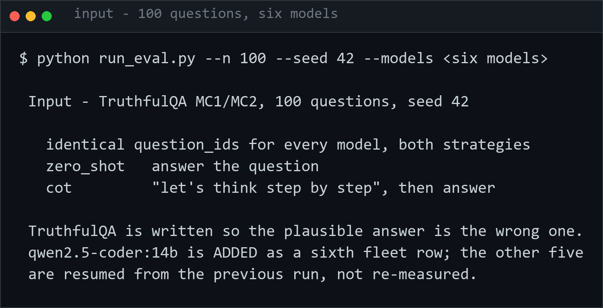
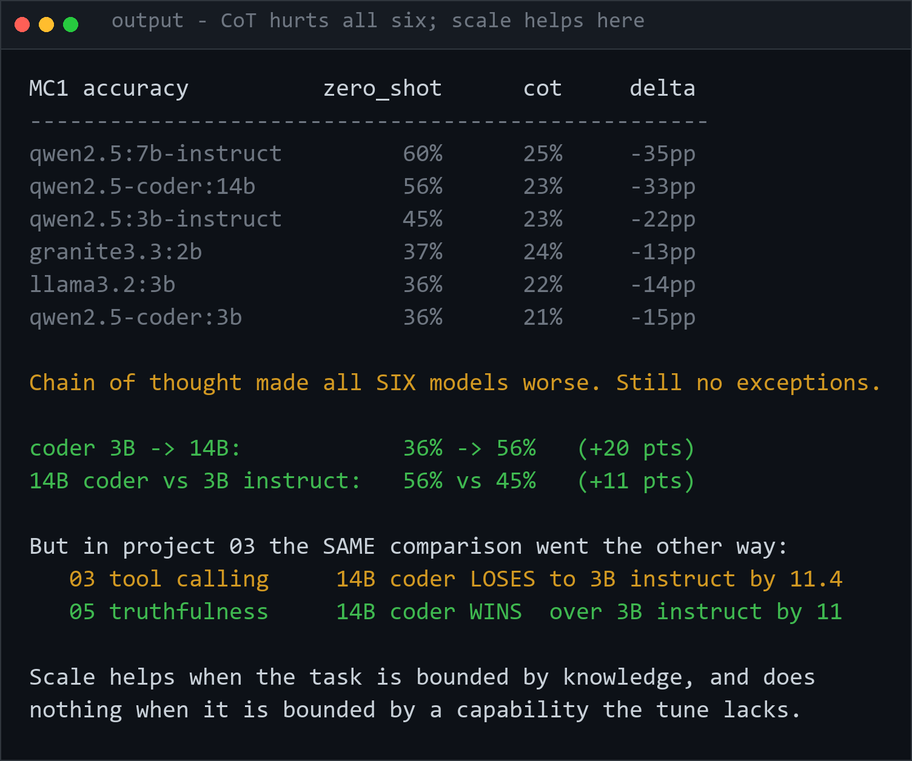
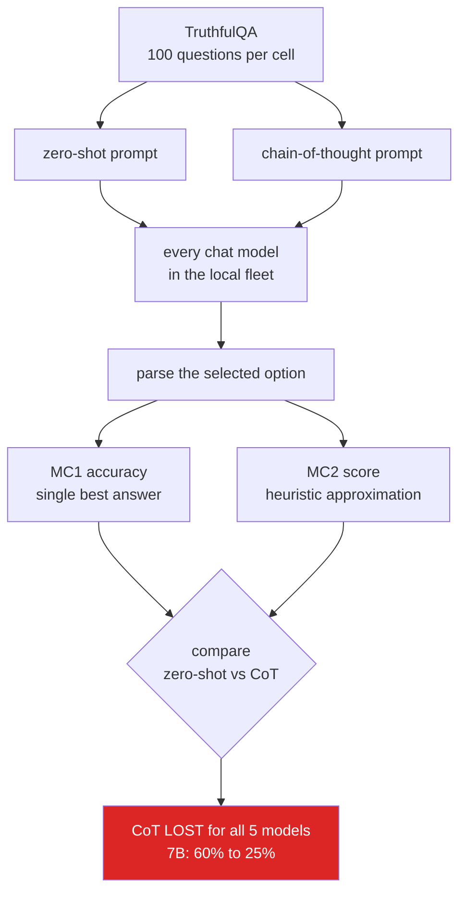

# 05 · Hallucination Rate Across the Local Fleet (Datasets, Ollama, httpx)

Real, measured hallucination/misconception rate for every chat-capable model
in the local Ollama fleet, on the real, published TruthfulQA benchmark,
comparing two prompting strategies.

Libraries this code actually imports: `datasets` (`load_dataset`), `httpx`
(raw Ollama `/api/generate` calls — see `ollama_client.py`), `fastapi` +
`fastapi.templating.Jinja2Templates` (results viewer), stdlib `random`, `re`,
`string`, `json`, `argparse`. Tests use `pytest`.

## Dataset

Real TruthfulQA (`truthfulqa/truthful_qa` — the modern namespaced Hugging
Face id; the old bare `truthful_qa` name no longer resolves under current
`datasets`/`huggingface_hub`, see "Problems hit" below), `multiple_choice`
config, `validation` split (its only split, 817 rows total).

**100 of the 817 questions**, sampled by row index with
`random.Random(42).sample(range(817), 100)` — exact question ids recorded in
`results.json`'s `question_ids`.

## Method

- **MC1** (primary metric): exactly one option is labelled correct; did the
  model pick it? Matches the official TruthfulQA MC1 definition (does the
  model's top choice equal the true answer), with "top choice" read from an
  explicit chat answer instead of option log-probabilities.
- **MC2** (secondary metric): the *official* TruthfulQA MC2 score is
  normalized probability mass on true vs. false answers, which needs
  per-option log-probabilities that Ollama's `/api/generate` doesn't expose
  for arbitrary strings. `scoring.py` implements a documented, explicit
  stand-in instead: `recall_on_true_statements - false_positive_rate_on_false`,
  clipped to `[0, 1]` — rewards the same thing (mass on true, not false
  answers) from an explicit multi-select response. **This is a heuristic
  approximation, not the official metric.**
- Answer options are **deterministically shuffled per question** before
  presentation (the raw dataset always lists the correct MC1 answer first,
  which would let a model "win" by always guessing option A).
- Two prompting strategies compared, per model, per task: **zero_shot**
  (answer with only the letter) vs. **cot** ("let's think step by step",
  final line `Answer: X`) — a single deterministic pass, not a
  multi-sample self-consistency vote.
- Every chat-capable model in the local fleet: `granite3.3:2b`,
  `llama3.2:3b`, `qwen2.5-coder:3b`, `qwen2.5:3b-instruct`,
  `qwen2.5:7b-instruct`, and **`qwen2.5-coder:14b` (added 2026-09-16)**
  (`nomic-embed-text` excluded — embedding-only).

**2,400 real Ollama calls** (100 questions × 6 models × 2 strategies × 2
tasks). The original 5-model run took 2,190.6s; the 14B added 400 calls to
the same fixed sample (n=100, seed=42, identical `question_ids`), resumed
rather than re-run, and is kept alongside `results_baseline_5models.json`.

## Real measured results

### MC1 accuracy (n=100 per cell)

| Model | zero_shot | cot | Δ |
|---|---:|---:|---:|
| qwen2.5:7b-instruct | **60%** | 25% | **-35 pts** |
| **qwen2.5-coder:14b** | **56%** | 23% | **-33 pts** |
| qwen2.5:3b-instruct | 45% | 23% | -22 pts |
| granite3.3:2b | 37% | 24% | -13 pts |
| llama3.2:3b | 36% | 22% | -14 pts |
| qwen2.5-coder:3b | 36% | 21% | -15 pts |

### MC2 score (heuristic approximation, n=100 per cell)

| Model | zero_shot | cot | Δ |
|---|---:|---:|---:|
| **qwen2.5-coder:14b** | **0.525** | 0.198 | **-0.327** |
| qwen2.5:7b-instruct | 0.411 | 0.197 | -0.214 |
| qwen2.5:3b-instruct | 0.274 | 0.171 | -0.103 |
| llama3.2:3b | 0.283 | 0.193 | -0.090 |
| qwen2.5-coder:3b | 0.196 | 0.153 | -0.043 |
| granite3.3:2b | 0.266 | 0.264 | -0.002 |

## Finding

**Chain-of-thought made every single model worse, on every single metric, no
exceptions — now including a sixth model at 14B.** This is the opposite of what CoT is usually reached for. The
effect isn't small or noisy — it holds across all 5 models and both MC1/MC2 —
and it's *largest* on the model that was otherwise clearly the strongest:
`qwen2.5:7b-instruct` leads zero-shot MC1 by 15-24 points over every other
model, but "let's think step by step" erases nearly that entire advantage
(60% → 25%, landing in the same 21-25% band as every other model's CoT
score). Explicit reasoning on TruthfulQA appears to walk the model down a
path of plausible-sounding justification for the common misconception the
question is testing, rather than triggering more careful fact recall — the
better the model's zero-shot factual recall, the more room CoT has to talk it
out of the right answer.

### 2026-09-16 · the 14B coder, and why this project disagrees with project 03

`qwen2.5-coder:14b` was added as a new fleet row. It does **not** disturb the
CoT finding — it loses 33 points to CoT like everything else — but it lands
high on the zero-shot table:

| | |
|---|---:|
| coder **3B &rarr; 14B** on MC1 | **+20 points** (36% &rarr; 56%) |
| 14B **coder** vs 3B **instruct** | **+11 points** (56% vs 45%) |
| 14B **coder** vs 7B **instruct** | -4 points (56% vs 60%) |

On **MC2 it is the best model in the fleet outright**, at 0.525 against the
7B instruct's 0.411.

**This is the opposite of what the same two models did in
[project 03](../03_bfcl_tool_calling/), and the contrast is the interesting
part.** Same models, same 4.8x size jump, opposite verdicts:

| | 3B instruct vs 14B coder |
|---|---|
| **03 · tool calling** | 14B coder **loses** by 11.4 pts |
| **05 · truthfulness** | 14B coder **wins** by 11 pts |

The difference is what each task needs. BFCL needs a *capability* — emitting
Ollama's native `tool_calls` — which the coder tune does not have at either
size, so both coder models fall back to scraping text on the same 117 of 140
cases and no amount of scale fixes it. TruthfulQA needs factual recall, which
is exactly what scale buys.

**Scaling a model helps when the task is bounded by knowledge and does nothing
when it is bounded by a missing capability.** Neither project could show that
alone; they only show it together.

## Input

## Output

## Problems hit while building this

- **`load_dataset("truthful_qa", ...)` doesn't resolve** on the installed
  `datasets`/`huggingface_hub` versions — same class of break as HotpotQA's
  loader elsewhere in this repo. Fixed by using the namespaced
  `truthfulqa/truthful_qa` id.
- **The real 2,000-call run was killed mid-flight** by an unrelated sibling
  process's `taskkill //F //IM python.exe //FI "MEMUSAGE gt 50000"` (a
  different project being built in parallel in this same repo checkout,
  clearing its own stuck process and taking others down with it). Per-model,
  per-100-call checkpointing was added to `run_eval.py` specifically so a
  crash mid-run wouldn't lose progress or force fabricating results from a
  partial run — the run was restarted and completed for real afterward
  rather than reporting the killed run's partial numbers.
- **MC2's official metric isn't reproducible against Ollama's plain
  `/api/generate`** (no per-token log-probabilities for arbitrary option
  text) — documented as a heuristic stand-in rather than silently presenting
  an approximation as the real published metric.

---

## How it works

Both strategies run on identical questions with identical parsing, so the gap is
attributable to the prompt and nothing else.

## Keywords

TruthfulQA · hallucination · misconception · chain-of-thought · CoT prompting ·
prompt engineering · LLM evaluation · truthfulness · model comparison · Ollama ·
Qwen2.5 · local LLM · benchmark · negative result · prompting strategy
