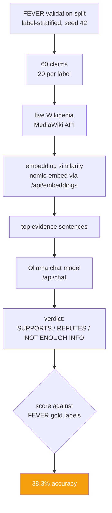

# 06 · Fact-Verification Agent (Datasets, HTTPX, FastAPI, Jinja2)

A real end-to-end FEVER fact-verification pipeline: sample real FEVER claims from Hugging
Face, retrieve real evidence sentences from live Wikipedia via embedding similarity, get a
verdict from a local Ollama chat model, and score against FEVER's real published labels.
No API keys, no external LLM calls, no synthetic data anywhere in the pipeline.

Libraries this code actually imports: `datasets` (Hugging Face, to load FEVER), `httpx`
(Ollama's REST API and the MediaWiki API), `pytest` (tests). It does **not** use `langchain-core` /
`langchain-ollama` — Ollama's `/api/embeddings` and `/api/chat` endpoints are called
directly over HTTP, which was simpler than going through a framework wrapper for two
endpoints.

## Dataset

**Claims + gold labels + gold evidence:** `fever/fever` on Hugging Face, config `default`,
split `validation`, loaded from the auto-generated `refs/convert/parquet` branch (the
dataset's own loading script, `fever.py`, is no longer runnable — `datasets` removed script
support in v4+, and passing `trust_remote_code` is rejected outright on `datasets` 5.0.1,
which this repo pins). That parquet split's shape (78,947 flattened rows, one row per
claim/evidence-sentence pair, regrouping to claims with `label` in `{SUPPORTS, REFUTES,
NOT ENOUGH INFO}`) matches FEVER's official **labelled_dev** split (19,998 claims) described
in the FEVER paper, so that's the split this project uses.

**Sampling:** label-stratified, fixed seed (`42`), 20 claims requested per label ->
**60 claims evaluated** (exactly 20 SUPPORTS / 20 REFUTES / 20 NOT ENOUGH INFO — no label
ran short). SUPPORTS/REFUTES claims are preferentially sampled from those that actually
carry gold evidence sets (nearly all of them do; a claim with no annotated evidence for a
non-NEI label would be a data artifact). The exact sample is cached to
`data/claims_sample.json` and is reproducible: re-running `sample_claims(seed=42)` returns
the identical 60 claims.

**Wikipedia evidence corpus:** the task brief's suggested approach was to stream-filter
FEVER's own `wiki_pages` HF config for just the ~80 gold-evidence page titles our claim
sample references. That config also turned out to be script-based and unloadable the same
way (see "Problems hit" below), and the fallback — FEVER's raw `wiki-pages.zip` from
fever.ai — turned out to be infeasible on this sandbox's network (also see below). The
final approach: fetch the **current live Wikipedia** lead-section plaintext for the exact
79 gold-evidence titles via the MediaWiki API (`action=query&prop=extracts&exintro=1`,
batched 50 titles/request). 77/79 titles resolved (2 legacy titles no longer resolve on
current Wikipedia, even through redirects). This yielded **436 real sentences** across 77
real Wikipedia pages — the shared retrieval pool for all 60 claims (not per-claim; every
claim's retriever has to find the right sentences among genuine distractors from the other
59 claims' pages, which is what makes the retrieval step real rather than a lookup by ID).

## Method

1. **Retrieval** (`retrieval.py`): every pool sentence and every claim is embedded with
   `nomic-embed-text` via Ollama's `/api/embeddings`. For each claim, the top-5 pool
   sentences by cosine similarity are retrieved as evidence.
2. **Verdict** (`verdict.py`): the claim + its top-5 retrieved (title, sentence) pairs are
   given to a local Ollama chat model (`qwen2.5:7b-instruct`) with a system prompt asking
   for exactly one of FEVER's own three labels plus a one-line reason. Output is parsed with
   a regex + alias table (also accepts the task brief's SUPPORTED/REFUTED wording).
3. **Scoring** (`pipeline.py`): predicted label vs. FEVER's gold label -> accuracy, a 3x4
   confusion matrix (the 4th column is `PARSE_ERROR`, unused in the actual run — the model
   never produced an unparseable response), and a secondary **evidence title recall**
   metric: the fraction of gold-evidence-bearing claims for which at least one retrieved
   sentence's Wikipedia title matched a gold evidence title. Exact gold sentence-ID
   matching (FEVER's official evidence-sufficiency metric) is **not** implemented, because
   it isn't meaningful here — our evidence sentences come from current Wikipedia, not
   FEVER's frozen 2017 snapshot, so sentence indices don't line up even when the page does.

## Real result (this exact run)

60 claims, `qwen2.5:7b-instruct` (verdict) + `nomic-embed-text` (embeddings), top-k=5,
seed=42. Full numbers, including every claim/retrieval/verdict, are in `results.json`.

| metric | value |
|---|---|
| Overall accuracy | **38.3%** (23/60) |
| SUPPORTS accuracy | 25.0% (5/20) |
| REFUTES accuracy | 5.0% (1/20) |
| NOT ENOUGH INFO accuracy | 85.0% (17/20) |
| Evidence title recall | 57.4% (31/54 gold-evidence-bearing claims) |
| Wall-clock time | 466.8s (~7.8 min) for the whole pipeline |

Confusion matrix (rows = gold, columns = predicted):

| gold \ pred | SUPPORTS | REFUTES | NOT ENOUGH INFO |
|---|---|---|---|
| SUPPORTS | 5 | 0 | 15 |
| REFUTES | 1 | 1 | 18 |
| NOT ENOUGH INFO | 2 | 1 | 17 |

**The real finding: the agent is heavily biased toward "NOT ENOUGH INFO," and retrieval
quality — not the verdict model's reasoning — is the main bottleneck.** 33 of 60
predictions were NOT ENOUGH INFO regardless of the true label. This tracks directly with
the 57.4% evidence title recall: for the ~43% of gold-evidence claims where none of the
top-5 retrieved sentences even came from the right Wikipedia page, answering NOT ENOUGH
INFO is actually the *correct* response to the evidence the model was shown — it's just the
wrong answer relative to FEVER's gold label, because the real evidence exists somewhere our
436-sentence pool didn't surface. For example, claim 1093 ("Henry Cavill is part of the DC
Extended Universe", gold SUPPORTS) retrieved five completely unrelated sentences (Annabelle,
Barbarella, Bermuda Triangle, Bulgaria, Chumlee) — Henry Cavill's own page was fetched but
its lead section apparently doesn't mention the DCEU explicitly enough for embedding
similarity to surface it, and the fact is presumably in a later section we never fetched
(see "lead-section only" limitation below).

Even when retrieval *did* find the right page, the verdict model still leaned NOT ENOUGH
INFO more often than not (e.g. claims 6462, 25115, 68412, 78080 all had `evidence_title_hit:
true` but were still scored NOT ENOUGH INFO) — plausibly a real, separate effect: the system
prompt explicitly tells the model to prefer NOT ENOUGH INFO when evidence "does not clearly
confirm or contradict" the claim, and a single relevant sentence found via cosine similarity
often states an adjacent fact rather than the exact fact needed. One clear model-level (not
retrieval-level) mistake did occur: claim 25748 ("Adam Lambert's album premiered at number
one on the U.S. Billboard 200 in 2009", gold REFUTES) retrieved a sentence that literally
says "The album premiered at number one on the U.S. [Billboard 200]" — genuinely on-topic,
directly relevant evidence — yet the model answered SUPPORTS. The claim is REFUTES because
that premiere happened later (with a different album), not in 2009; catching that requires
noticing a *year* mismatch across two separate retrieved sentences, which the model did not
do. REFUTES claims are the hardest category throughout this run (5% accuracy) for exactly
this reason: FEVER REFUTES claims are usually near-misses on a true fact (wrong year, wrong
person, wrong exclusivity), and both a retrieval step tuned for topical similarity and a
verdict model that defaults to caution will tend to call them NOT ENOUGH INFO instead of
actively catching the contradiction.

## Problems hit while building this

- **`fever/fever`'s loading script is dead.** `datasets` 5.x removed script-based dataset
  loading entirely (`trust_remote_code` is rejected outright, not just deprecated), so
  `load_dataset("fever", "v1.0", split="labelled_dev")` fails with `RuntimeError: Dataset
  scripts are no longer supported`. Fixed by loading from the dataset's auto-generated
  `refs/convert/parquet` branch instead (`load_dataset("fever/fever", split="validation",
  revision="refs/convert/parquet")`), which HF builds automatically for legacy script-based
  datasets and doesn't need a script at all.
- **The `wiki_pages` HF config has the identical problem** (and isn't even exposed on the
  parquet branch, which only carries `default`/`train`/`validation`/`test`), so the task
  brief's literal suggestion (`load_dataset(..., "wiki_pages", streaming=True)`) doesn't
  work on current `datasets` either.
- **FEVER's own raw `wiki-pages.zip` (fever.ai) is real and reachable, but this sandbox's
  bandwidth to it made streaming it infeasible.** Confirmed the interesting part works:
  `fsspec`'s HTTP filesystem can open the 1.7GB zip and list/read individual shard entries
  via HTTP range requests without downloading the whole archive (central directory listing
  for all 109 shards took ~3s). But actually measured throughput was ~150KB/s
  (`curl -w '%{speed_download}'` against the same URL), and decoding a single 53MB shard
  took 113 seconds — with target titles scattered non-alphabetically across shards, a full
  scan for ~80 titles could take hours. Abandoned in favor of fetching the same titles'
  text from live Wikipedia instead (see Dataset section above); this is the single biggest
  scope change from the original plan, made for a measured, documented reason rather than
  a guess.
- **MediaWiki's `extracts` API only returns the *full* article as plain text for one page
  per request for anonymous callers** (`"exlimit was too large for a whole article extracts
  request, lowered to 1"`), which silently discarded all but one page's text the first time
  a >1-title batch was tried. Fixed by requesting `exintro=1` (lead section only), which
  isn't subject to that limit and made batching 50 titles/request work — at the cost of only
  having lead-section text available (see the Henry Cavill example above).
- **FEVER encodes literal parentheses in titles as `-LRB-`/`-RRB-`** (e.g.
  `Tom_Baker_-LRB-English_actor-RRB-`), which MediaWiki does not understand; the first
  version of the fetcher converted this back to `(` / `)` only when reading the API
  *response* back, not before sending the request, so bracketed titles silently 404'd.
  Caught by testing a 9-claim sample before the full 60-claim run.
- **A bare `print()` of a Wikipedia title crashed the run on Windows.** Some page titles
  contain non-ASCII characters (e.g. combining diacritics), and this sandbox's Windows
  console defaults to the legacy `cp1252` codepage, which can't encode them —
  `UnicodeEncodeError` killed an otherwise-successful run at the very last progress line.
  Fixed with `sys.stdout.reconfigure(encoding="utf-8", errors="replace")` in `run_eval.py`.
- **Numeric-prefixed project folder + generic module names is a real collision risk in this
  shared repo.** This project's own modules (`data.py`, `config.py`, ...) can't be imported
  as a package (`06_...` isn't a valid identifier) and use plain top-level filenames that
  five sibling `*-lab` projects in this same repo checkout also use. A naive `import
  config` after adding this directory to `sys.path` would risk silently resolving to a
  *different* project's `config.py` if both happened to load in the same Python process
  (e.g. a combined `pytest` run across all projects' test files). Every module here loads
  its siblings through a small `_sibling()` helper keyed by a project-unique
  `sys.modules["fever06_<name>"]` name instead of a bare import, specifically to make that
  impossible regardless of what other agents' projects do.
- **Cold-start model load timeouts.** The very first Ollama chat call in a fresh session
  took ~31s just to load `qwen2.5:7b-instruct` into memory (subsequent warm calls: ~2.2s),
  which blew past an initial 120s client timeout once retrieval + embedding overhead was
  added on top. Fixed by giving the chat client a 180s timeout.

## Running it

```bash
uv run python projects/06_fever_fact_verification/run_eval.py --n-per-label 20 --seed 42
uv run pytest tests/test_06_fever.py -m "not live"   # pure-Python tests, no server needed
uv run pytest tests/test_06_fever.py -m "live"       # needs a running local Ollama
```

## What's finished vs. left for follow-up

Finished: real dataset sampling (60 claims, reproducible), real live-Wikipedia evidence
fetch (77 pages, 436 sentences), real embedding retrieval, real local Ollama verdicts, real
measured scoring (accuracy + confusion matrix + evidence recall) written to `results.json`,
34 passing pytest tests (31 non-live + 3 `@pytest.mark.live`), a minimal FastAPI+Jinja2
results viewer.

Left for follow-up: fetching full article text (not just lead sections) for pages where the
gold fact lives later in the article; a proper NLP sentence tokenizer instead of the regex
splitter here; FEVER's official evidence-sufficiency scoring (would need FEVER's own 2017
snapshot text to be meaningful, which is exactly the corpus this project couldn't
feasibly stream — see above); trying a larger top-k or a rerank step to raise the 57.4%
evidence recall, which is the clearest lever on overall accuracy given the analysis above.


---

## How it works



Evidence comes from **live Wikipedia**, not a frozen dump, so retrieval quality is a real
variable rather than a fixed corpus - and the README says what that costs in
reproducibility.

## Keywords

FEVER · fact verification · fact checking · claim verification · evidence retrieval ·
Wikipedia · MediaWiki API · natural language inference · NLI · embedding retrieval ·
nomic-embed · Ollama · FastAPI · local LLM · misinformation · LLM evaluation
